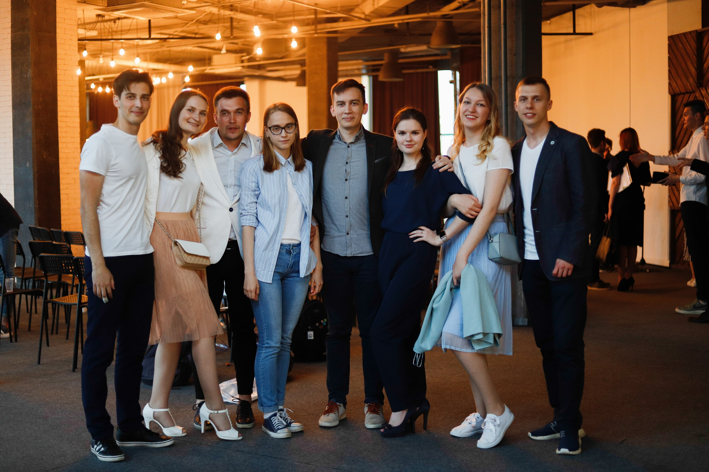
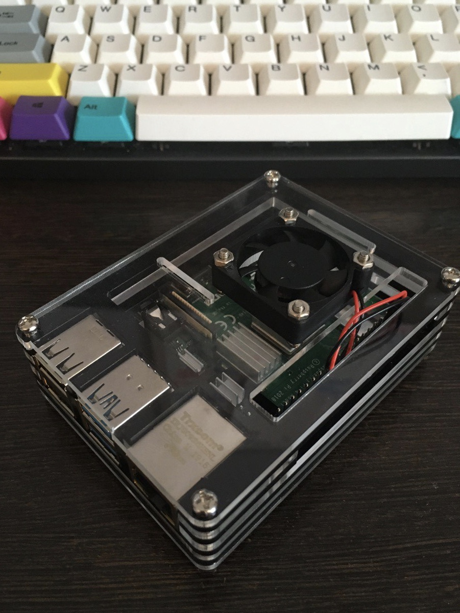
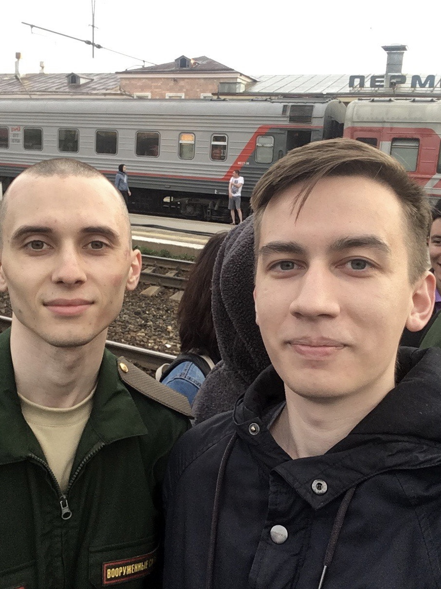
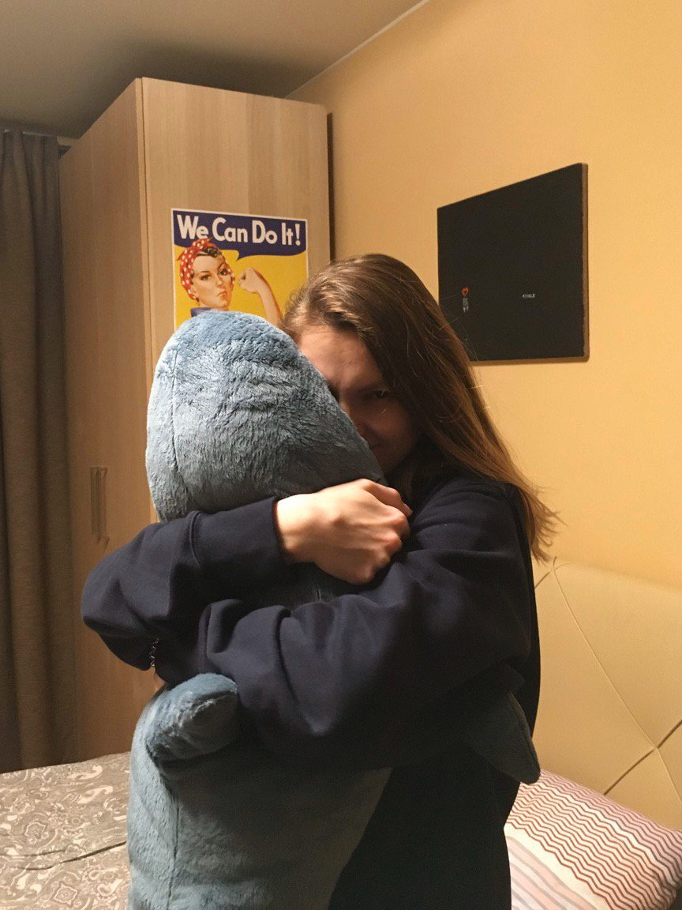
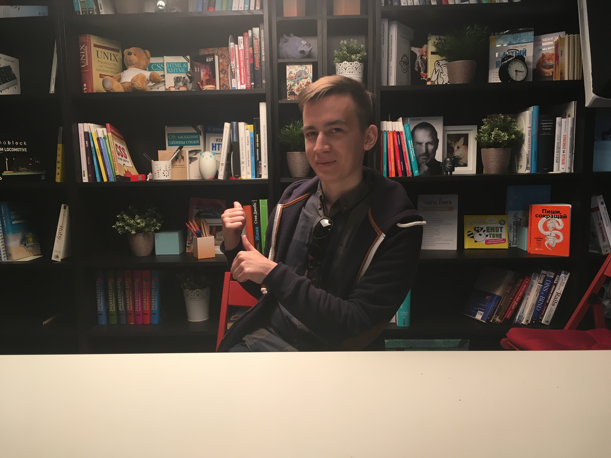
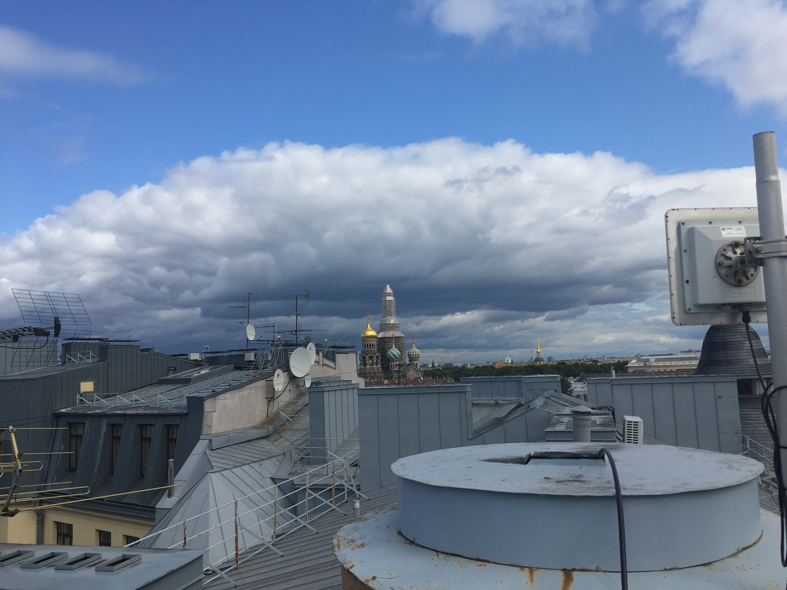

> 2019 год был настолько насыщенным, что в одну инстаграм галерею всё не влезет. Поэтому я написал большой пост со своими итогами. Велкам.

## Учеба

В этом году я защитил диплом, сдал госы и закончил свое пятилетнее обучение. Стал специалистом в области защиты информации. Немного не дотянул до красного диплома, но это не очень обидно, потому что на самом деле я не считаю, что знаю программу на 5. Я даже не уверен, что знаю на 4.

Главное, что мне дал университет, — это базовые знания по программированию, опыт общественной деятельности, расширение кругозора. А еще полезные связи, друзей и любовь. Наверное, это уже довольно неплохо. Правда, никто не говорил мне, что когда переезжаешь в другой город, связи в Перми становятся чуть менее, чем бесполезными, с профессиональной точки зрения.

## Резонанс

В этом году нам не удалось выпустить ни одного выпуска, но зато мы сняли один. Когда-нибудь он выйдет, и все его посмотрят. А пока можно посмотреть выпуск с Иваном Николаевичем Черепановым.

<iframe width="853" height="480" src="https://www.youtube.com/embed/6y2m9Cg0gQ0" frameborder="0" allow="accelerometer; autoplay; encrypted-media; gyroscope; picture-in-picture" allowfullscreen></iframe>

Еще я впервые сменил роль редактора на одного из ведущих. Необычно. Мне кажется, я переволновался и временами нес ерунду.

## Работа

Я уволился с работы в Перми, устроился на новую в Питере, уволился и оттуда.

30 декабря был мой последний рабочий день. К счастью, я больше не повторяю своих ошибок, и не ухожу с работы без нового оффера. Ожидаю, что в новом году я найду то, чего мне не хватает, и буду счастлив выполнять свои задачи.

## Жилье

В начале этого года я обустроился в маленькой уютной пермской квартире, полюбил смотреть на рассветы со своего балкона.

Но затем мы переехали в Санкт-Петербург (всё ещё лучший город в России) и пришлось привыкать к новой квартире. Впрочем, она шикарна и помогает нам начать чувствовать себя как дома.

## Конференции, митапы, конкурсы

### Пермь. Ночь карьеры

Весной я помог организовать форум «Ночь карьеры - 2019». Примерно тогда я понял, что не хочу больше работать дизайнером. Ни платно, ни бесплатно. Мне сложно подстраиваться под желания клиента, который сам не очень понимает, чего хочет. Наверное, это не очень хорошее качество для программиста, но с кодом всё же полегче. Чаще всего люди, которые заказывают написать программу, лучше понимают, как она должна выглядеть и что должна делать.

Вот мои наброски по логотипу и оформлению группы. В дело они не пошли, оставлю хотя бы здесь.

Сейчас смотрю и понимаю: хорошо, что не пошли.

### Нижний Новгород. Так можно

Той же весной мы с ребятами из Перми съездили на журналистский форум [«Так можно»](https://takmozhno.io/) в Нижний Новгород. Образовательная и соревновательная часть хромали, зато город мне понравился. Пусть нам и не удалось долго погулять.

На третий день я сфотографировался с Максимом Ильяховым и Ильей Красильщиком. Это успех. Максим даже подписал мне экземпляр «Пиши, сокращай».

### Пермь. «Построение DevOps в бизнесе компании: нужен ли DevOps бизнесу» в Morion Digital и митап от компании КРОК в Digital Port

Даже вспомнить ничего.

### Пермь. IT Way Perm #1

Выиграл промокод на месяц обучения в Хекслете, которым почти не пользовался.

<small>[Видеоотчет](https://vk.com/video-99102435_456239094)</small>

### СПб. PiterCSS, PiterJS, SPB Frontend, митап в Grid Dynamics

За те три с половиной месяца, что я живу в Питере, я успел сходить почти на все заметные фронтендерские митапы, что здесь были. В Перми почти нет таких мероприятий, а тут я будто отрываюсь.

### СПб. [LongestJS #1](http://longestjs.org/)

Двухчасовой доклад Дениса Колесников про npm: что это, как устроен, как оптимизировать пакеты и публиковать. Мне понравился формат LongestJS, позволяющий глубоко раскрыть одну тему. Безмерно уважаю труд организаторов, жду второй митап.

Офис JetBrains — вышка. Один из лучших залов для презентаций, что я видел.

### Москва. HolyJS Moscow 2019

Не думал, что получится поехать на главную конференцию по Javascript'у в России, но мы с Ксюшей вызвались быть волонтерами, и нас позвали. Увидел там много известных спикеров и компаний. Поел вкусной еды. Огонь.

### Hacktoberfest 2019

Каждый год Digital Ocean и dev.to проводят конкурс «Hacktoberfest». Его смысл — показать людям, что вносить вклад в опен сорс не так сложно, как кажется. _Каждый Pull Request полезен._ В 2019 году и я приобщился к этой теме: я отправил 7 пулл-реквестов в разные репозитории. Потом они были приняты, а я получил свои подарки от организаторов. Приятно. Обязательно продолжу в следующем году.

### СПб. Women in Tech Russia

Women in Tech — международная некоммерческая организация, миссия которой — помочь девушкам найти свое место в технологических отраслях. Показать, что мир, а в частности мир IT, свободен от гендерных предрассудков.

Считаю, что это важная тема, особенно после недавнего скандала с Яндексом и конкуренцией YaTalks. Об этом хорошо [написал](http://sergeykorol.ru/blog/gender-confa/) Сергей Король.

Нам с Ксюшей понравилось. Ждем следующего митапа.

## Градостроительство

Построил несколько городов в Cities: Skylines — лучшем градостроительном симуляторе современности.

  
Несколько скриншотов из двух моих городов

  

  

  

  

  

  

  

  

Когда-нибудь я напишу о городах поподробнее.

## Технологии

Углубил знания в React, Redux, NodeJS, CI/CD. На прошлой работе завёз Svelte в проект и использовал в production'е.

## Стикеры

Полюбил стикеры с котами и попугами. Они скрепляют отношения, потому что невозможно обижаться, когда тебе присылают такое. Советую взять на вооружение.

Скрыл немного котов под спойлер, если у кого-то на них аллергия.

  
Котики

  
  
  
  
  
  
  
  
  

## Подкасты

Продолжил слушать подкасты. Нашел много новых. Их очень много, постараюсь описать отдельно в будущем.

## Книги

Прочитал:

Забросил или еще не дочитал:

- «Счастливый город», Чарльз Монтгомери
- «Зулейха открывает глаза», Гузель Яхина
- «Секреты CSS. Идеальные решения ежедневных задач», Лиа Веру
- «Сильные стороны JavaScript», Дуглас Крокфорд

Негусто.

## Еще

- Снялся в фотосессии.
  
- В квартиру залетела птичка. Я отнес ее на балкон, чтобы она улетела.
  <figure>
    <video src="./videos/Птичка.MOV" controls="true"></video>
    <figcaption>Птичка запуталась в рюкзаке</figcaption>
  </figure>
- Выпустился из профсоюза.
  
- Был на двух стендапах: к нам в Перми сначала приехали Идрак Мирзализаде и Алексей Квашонкин, а потом и весь состав «Порараз Бирацца».
- Впервые попрыгал в батутном центре.
- Купил механическую клавиатуру, Raspberry Pi, электросамокат и пылесос. Пылесос, очевидно, наиболее полезный в этом списке.
  
- Был на последнем своем Дне физика.
  
- Состарил себя в FaceApp.
  
- Впервые перевел [статью](https://learn.javascript.ru/rest-parameters-spread-operator) с английского.
- Видел, как возле моей прошлой работы, на пермской набережной, снимают «Реальных пацанов».
  
- Начал платить за жилье в 4 раза больше, но и зарплата выросла в 2.5 раза. Боже, благослови айти.
- Уже почти уволившись, сходил на корпоратив.
  
- Сырки Б.Ю. Александров в магазинах Питера неожиданно дёшевы: стоят ~32-40 рублей, а не 50+, как в Перми.
- Проводил друга в армию.
  
- Продолжил [откладывать на пенсию](https://en.wikipedia.org/wiki/FIRE_movement): купил еще государственных облигаций, а акции принесли доход 30%. Спасибо Яндексу, Газпрому, Сбербанку и ВТБ.
- Последние 4 месяца мы вместе с Ксюшей записываем расходы в приложении. Это помогает нам следить за тратами и рассчитывать бюджет на следующие месяцы.
- Встретил многих людей, известных в русскоязычном IT-сообществе.
- Поднялся в группе английского: с Pre-Intermediate до Intermediate. Начал читать несколько блогов на английском. Твиттер лента состоит из англоязычных твитов где-то на треть.
- Впервые в жизни ехал в купе, а еще в Ласточке и Сапсане. В этом году я вообще много ездил на поездах.
- Купили акулу в Икее.
  
- Побывал в офисе HTML Academy и на каноничной питерской крыше. Спасибо Вадиму Макееву за гостеприимство.
  

  

  

  <iframe allow="autoplay *; encrypted-media *;" frameborder="0" height="150" style="width:100%;max-width:660px;overflow:hidden;background:transparent;" sandbox="allow-forms allow-popups allow-same-origin allow-scripts allow-storage-access-by-user-activation allow-top-navigation-by-user-activation" src="https://embed.music.apple.com/ru/album/%D0%BF%D0%B8%D1%82%D0%B5%D1%80%D1%81%D0%BA%D0%B8%D0%B5-%D0%BA%D1%80%D1%8B%D1%88%D0%B8/1422642477?i=1422642890&l=en"></iframe>

- Начал ходить к психологу.
- Много гулял.
  

  

  

- Вместе с Ксюшей приоткрыли для себя локальный туризм. Пока были только в Выборге, но хочется еще.

## Не удалось осуществить

- Не доделал блог и сайт для экспериментов.
- Не настроил Raspberry Pi, как хотел. Не реализовал полезных проектов на ней.
- Не прошел на стажировку в Тинькофф и Яндекс.
- Не прошел собеседования в Альфа-банк, OneTwoTrip, СКБ Контур.
- Хотел выучить Angular, Dart, Go, Rust, NodejS + NestJS. Не выучил.

## Планы на 2020 год

- Доделать то, что не успел сделать в этом году.
- Пожить хотя бы две недели в англоговорящей стране. В это время полностью исключить русскую речь из своей жизни.
- Смотреть фильмы и сериалы на английском с субтитрами, чтобы лучше понимать английский на слух.
- Освоиться на новой работе, быстро начать приносить ощутимую пользу.
- Продолжить ходить на митапы и конференции, попробовать помочь с организацией.
- Больше читать.

