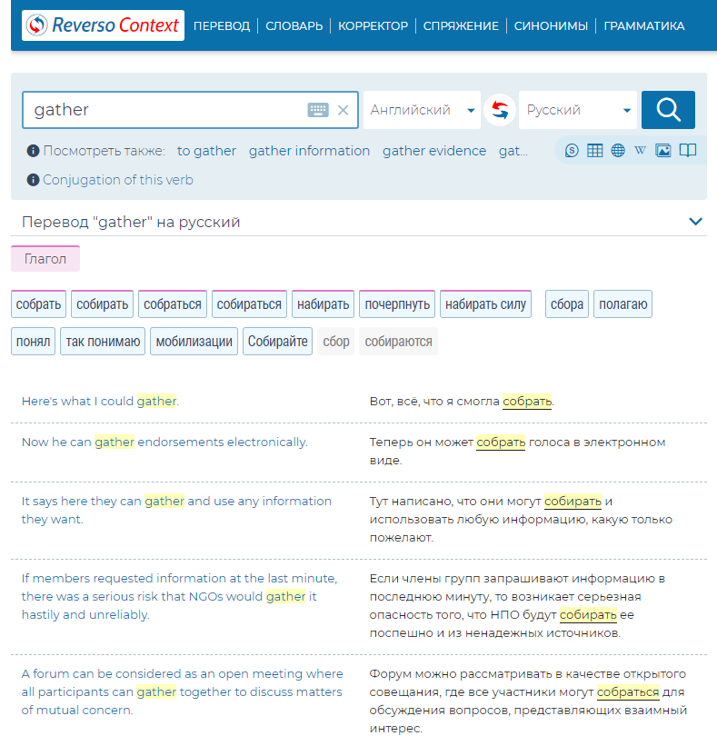
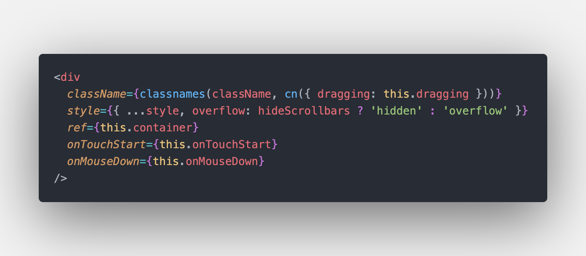

На днях я послушал [171 выпуск подкаста «Веб-стандарты»](https://soundcloud.com/web-standards/episode-171). Вадим Макеев в нем рассказал, что Илья Кантор начал перевод [javascript.info](javascript.info) на русский язык.

Вообще это довольно смешно — изначально существовал сайт javascript.ru. Потом появился learn.javascript.ru, по которому я год назад начал изучение веба. Затем Илья с нуля написал новый учебник на английском языке, и сейчас туториал переводится обратно на русский.

Я решил помочь, чем смогу. Мне всегда хотелось попереводить что-нибудь. А тут подвернулся хороший проект, которому я во благодарен. У меня есть возможность вернуть долг.

## Процесс

Тему выбрал такую — [Rest parameters and Spread operator](https://javascript.info/rest-parameters-spread-operator). Я не на 100% знал, как под капотом работает `...`-оператор. Перевести туториал — отличный способ разобраться в технологии.

На перевод ушло 2 дня. Я работал где-то по 3-4 часа. В первый день перевел большую часть, потом — редачил и оформлял пулл-реквест.

Мне сильно помог сервис [Reverso Context](https://context.reverso.net/перевод/).

Это поисковая система для поиска переводов в контексте. Туда можно ввести слово или фразу, а Reverso Context покажет, как другие переводчики справлялись с переводом этой строки. Спасибо Илье Бирману, который когда-то рассказал о нем в своем телеграм-канале.

Еще я пользовался [словарем Веб-стандартов](https://github.com/web-standards-ru/dictionary/blob/master/dictionary.md).

Был забавный момент. Чтобы проверить, как текст будет выглядеть на странице, можно склонировать себе на машину сервер и поднять его. У меня он, конечно, не поднялся, но я нашел в конфигах ошибку и исправил ее. Потом написал на почту Илье Кантору, что в репозитории нужно обновить пару строк. Илья сказал мне спасибо, но в следующий раз лучше создать ишью на гитхабе.

---

Вот так сегодня я сделал свой первый вклад в опенсорс. Осталось подождать, пока PR примут. Ну или не примут. Тогда я исправлю замечания, и отправлю пулл-реквест еще раз.

## Что дальше

Следующая моя цель — компонент [React Indiana Drag Scroll](https://github.com/Norserium/react-indiana-drag-scroll). Для своей рабочей задачи я долго искал библиотеку, которая позволила бы удобно скроллить горизонтальный контейнер зажатой клавишой мыши. Этот компонент мне идеально подошел!

Только посмотрите, какая классная демка — [🗺️](https://norserium.github.io/react-indiana-drag-scroll/).

Там есть проблема. Написано, что пропс `hideScrollbars` должен добавить скроллбар.

| Prop           | Type | Description         | Default |
| -------------- | ---- | ------------------- | ------- |
| ...            | ...  | ...                 | ...     |
| hideScrollbars | Bool | Hide the scrollbals | true    |
| ...            | ...  | ...                 | ...     |

Но он не работает. Проблема здесь:

Вместо `overflow` должно быть значение `visible`.
Как дойдут руки, попробую исправить ошибку и отправить Pull request.

А пока, продолжу писать статью для конференции «Физика для Пермского края» и готовиться к диплому. Предзащита уже близко.

❄📘🎓
