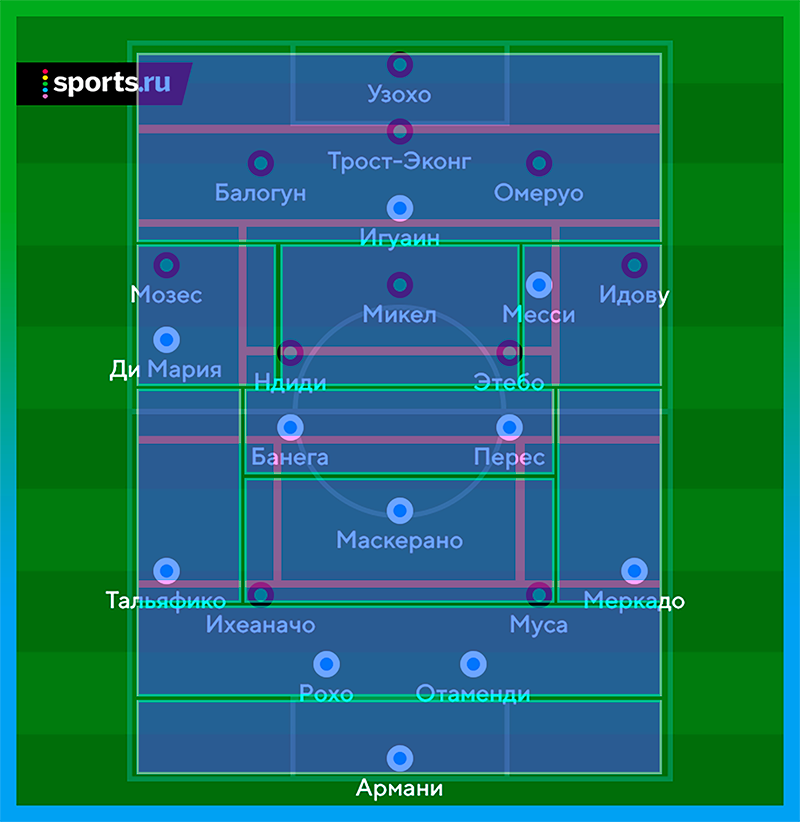
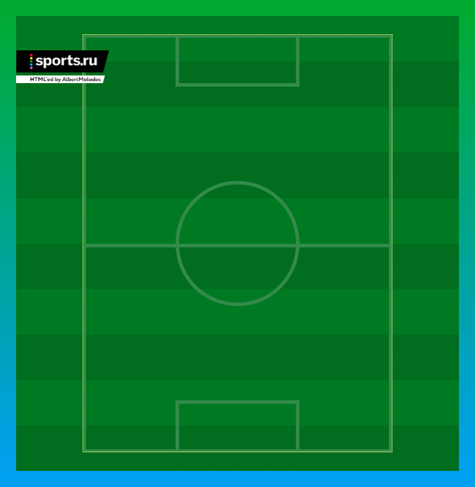
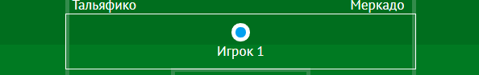
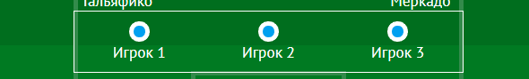
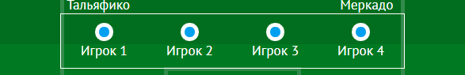

Недавно я устроился на работу стажером-тестировщиком. Но, как и предупреждал один из моих прошлых преподавателей, я начал деградировать как программист. Тогда я стал искать сферу, в которой не буду скучать, а буду кайфовать. Уволился, подумал и понял, что веб-разработка мне подойдет. Начал изучать HTML и CSS. Прошел 20 базовых курсов на [HTML Academy](https://htmlacademy.ru) и прочитал несколько десятков статей в интернете. Захотелось применить полученные навыки на практике.

Недавно я увидел [текст Вадима Лукомского о матче Аргентина — Нигерия](https://www.sports.ru/tribuna/blogs/vadimlukomski/1759097.html) с классной графикой. Мне захотелось воссоздать ее в вебе. Это сошло бы за «выпускную» работу по итогам базовых курсов.

Пока что это даже не программирование, а только интернет-верстка. Как только опубликую этот пост, сразу начну марафонить JavaScript.
_Спасибо **HTML Академии** за подарок — годовую подписку на продвинутые курсы._

## Цель

1. Создать копию этой картинки средствами HTML и CSS.
   
   Пользователь должен иметь возможность выделять имена игроков мышкой, при желании изменить размеры элементов через отладчик.
1. Должно быть похоже на оригинал. Я не гонюсь за [Pixel Perfect](http://zencoder.ru/web-development/pixel-perfect/), но всё же.
1. Картинка должна тянуться при увеличении и уменьшении экрана. Размеры текста и кружков игроков тоже должны меняться.

## Результат

<p data-height="500" data-theme-id="light" data-slug-hash="NzEjNo" data-default-tab="result" data-user="albertmolodec" data-embed-version="2" data-pen-title="Football Grid (flexible)" class="codepen">See the Pen <a href="https://codepen.io/albertmolodec/pen/NzEjNo/">Football Grid (flexible)</a> by Albert Abdulmanov (<a href="https://codepen.io/albertmolodec">@albertmolodec</a>) on <a href="https://codepen.io">CodePen</a>.</p>
<script async src="https://static.codepen.io/assets/embed/ei.js"></script>

Можно зайти в CodePen, потянуть экран вправо-влево. Сейчас размер контейнера привязан к ширине viewport'а.

## Создание

### Схема

Смотрю на исходное изображение. Нужно как-то поделить на фрагменты и сверстать.
Решаю сделать так:

1. Есть главный контейнер. Вокруг него градиентная рамка под цвет играющих команд.
2. Внутри газон из 10 полос: светлозеленый чередуется с темно-зеленым. Всё как на обычном футбольном газоне.
3. Затем разметка игрового поля: граница игрового поля, вратарские площади, середина поля, центральный круг. Для отрисовки подойдут простейшие геометрические примитивы: прямоугольник и круг.
4. Поле поделено на позиции. На одной позиции может быть несколько игроков. Такое часто бывает, например, в центре защиты. Покажу это на схеме чуть позже.
5. Внутри позиций располагаются игроки.
6. Внутри контейнера `player` лежат круглая иконка и имя игрока.


### Структура в HTML

Пишу код.

HTML — что изображаем, CSS — как выглядит. Начну с HTML.

#### Внешний контейнер и газон

Сначала опишу все контейнеры и классы. Создаю внешний — `.football-container`. Внутри него газон. Он представляет собой ненумерованный список из 10 элементов.

```html
<div class="football-container outline-border">
  <ul class="grass">
    <li></li>
    <li></li>
    <li></li>
    <li></li>
    <li></li>
    <li></li>
    <li></li>
    <li></li>
    <li></li>
    <li></li>
  </ul>
  ...
</div>
```

#### Разметка

Затем идет разметка игрового поля: границы, середина, центральный круг, вратарские площадки.

```html
<div class="football-container outline-border">
  ...
  <div class="markup">
    <div class="border"></div>
    <div class="separator"></div>
    <div class="central-circle"></div>
    <div class="penalty top"></div>
    <div class="penalty bottom"></div>
  </div>
  ...
</div>
```

#### Позиции

Пишу контейнер `.playing-field` для того, чтобы поместить там все игровые позиции. В них, я напомню, — игроки.

```html
<div class="football-container outline-border">
  ...
  <div class="playing-field">
    <!-- Позиции игроков (дома, в гостях) -->
    <div class="zone zone-home home-cb">
      <div class="player">
        <div class="circle home"></div>
        <span class="name">Балогун</span>
      </div>
      <div class="player">
        <div class="circle home"></div>
        <span class="name">Трост-Эконг</span>
      </div>
      <div class="player">
        <div class="circle home"></div>
        <span class="name">Омеруо</span>
      </div>
    </div>
    <!-- И еще 19 игроков -->
  </div>
  ...
</div>
```

Каждый игрок завернут в див с классами позиции и принадлежности стороне: `home-cb`, `home-gk`, `away-cm`...

#### Идентичность

В конце два логотипа: Sports.ru и мой. Это единственные элементы, которые я нарисовал в фотошопе.

```html
<div class="football-container outline-border">
  ...
  <div class="sports-logo"></div>
  <div class="my-logo"></div>
</div>
```

### Структура игровых позиций

Прежде чем я перейду к CSS-правилам, нужно остановиться на том, как поле делится на позиции.

Я потратил многие часы своей жизни, играя в FIFA. Играл почти во все игры серии, которые застал. Начиная с FIFA 2007 и заканчивая FIFA 2017. Я привык к их нотации обозначения позиций и использую ее в этом проекте.

| Аббревиатура | Позиция                            |
| ------------ | ---------------------------------- |
| gk           | Вратарь                            |
| lb           | Левый защитник                     |
| cb           | Центральный защитник               |
| rb           | Правый защитник                    |
| cdm          | Опорный полузащитник               |
| cm           | Центральный полузащитник           |
| cam          | Атакующий центральный полузащитник |
| lw           | Левый вингер                       |
| cf           | Центральный нападающий             |
| rw           | Правый вингер                      |

Я поделил поле на такие участки:

| Команда, играющая дома                                           | Гости                                                            |
| ---------------------------------------------------------------- | ---------------------------------------------------------------- |
|  |  |

Потом наложил их в фотошопе и получил такую картину:



Каждый получившийся маленький прямоугольник — это ячейка сетки. Я описал эту сетку в коде при помощи CSS Grid.

Cтолбцов получилось 5, строк — 11. Всего ячеек 55.

### CSS-правила

#### Размеры

До этого я работал только с фиксированными размерами: пикселями и пунктами. Захотелось попробовать что-то новое, поэтому я задал размеры контейнера в vw — процентах ширины окна браузера:

```css
.football-container {
  display: block;
  position: relative;
  width: 50vw;
  height: 51.35vw;
  margin: 0 auto;
}
```

Ширина — 50vw, высота — 51.35vw. Как бы я не изменял размер окна, ширина контейнера и всегда занимает половину ширины экрана.

#### Граница контейнера

В исходном файле граница градиентная — идет сверху вниз, от зеленого к голубому. Ну или снизу вверх и от голубого к зеленому. Тут уж как посмотреть.

В моем проекте за это отвечает класс `outline-border`, присвоенный основному контейнеру:

```css
.outline-border {
  border-width: 1.7vw;
  border-style: solid;
  border-image: linear-gradient(to top, #00a0f0, #00aa32) 1 1;
  box-sizing: border-box;
}
```

<div style="display: flex; flex-direction: row; width: 100%; justify-content: space-around;">
    <div style="display: flex; width: 30%; height: 100px; margin: 0 5px; padding: 10px; text-align: center; border-width: 10px; border-style: solid; border-image: linear-gradient(to top, #fd48ff, #00ffff) 1 1; justify-content: center; align-items: center;">
      <p style="margin: 0px;">Пример 1</p>
    </div>
    <div style="display: flex; width: 30%; height: 200px; margin: 0 5px; padding: 10px; text-align: center; border-width: 10px; border-style: solid; border-image: linear-gradient(to left top, #fd48ff, #00ffff) 1 1; justify-content: center; align-items: center;">
      <p style="margin: 0px;">Пример 2</p>
    </div>
</div>

#### Газон


Было бы круто сделать такой, но, наверное, не сейчас.

У меня попроще. Мой газон состоит из 10 элементов ненумерованного списка. Они представлены блоками: каждый занимает по 100% ширины поля и по 10% его длины.

```css
.grass {
  position: absolute;
  top: 0;
  left: 0;
  margin: 0;
  padding: 0;
  width: 100%;
  height: 100%;
}

.grass li {
  display: block;
  width: 100%;
  height: 10%;
  background-color: #006e1e;
}
```

Изначально все полосы темно-зеленые. Нужно как-то менять цвет у нечетных элементов. Я использую для этого псевдокласс `:nth-child` с параметром `odd`.

```css
.grass li:nth-child(odd) {
  background-color: #007a22;
}
```

#### Разметка поля


Для того, чтобы создать такую вот белую разметку, я создал див с классом `markup` внутри главного контейнера, задал пропорции и расположил по центру. Еще спозиционировал относительно, чтобы внутренние дивы считались относительно него.

```css
.markup {
  display: block;
  position: relative;
  top: 4%;
  left: 15%;
  width: 70%;
  height: 92%;
}
```

Затем поочередно создал несколько контейнеров для каждой фигуры, задал им размеры и расположил в точном соответствии с макетом.

```css
.markup .border {
  display: block;
  width: auto;
  height: 100%;
  border: 0.4vw solid #338b4b;
}

.markup .separator {
  display: block;
  position: absolute;
  top: 50%;
  width: 100%;
  height: 50%;
  border-top: 0.4vw solid #338b4b;
}

.markup .central-circle {
  display: block;
  position: absolute;
  width: 40%;
  height: 30%;
  top: 35%;
  left: 30%;
  border: 0.4vw solid #338b4b;
  border-radius: 50%;
}

.markup .penalty {
  display: block;
  position: absolute;
  width: 40%;
  height: 12.5%;
  left: 30%;
  border: 0.4vw solid #338b4b;
}

.markup .penalty.top {
  top: 0;
}

.markup .penalty.bottom {
  bottom: 0;
}
```

Получилось вот это:



#### Позиции игроков

Пришло время расставить игроков на поле. Лучше всего для этого подойдет **CSS Grid**. Добавляю контейнер с классом `.playing-field` внутрь главного контейнера, делю на 5 столбцов и 11 строк. Пропорции — в соответствии с макетом.

```css
.playing-field {
  display: grid;
  width: 70%;
  height: 92%;
  margin: 4% 15%;
  position: absolute;
  top: 0;
  left: 0;
  grid-template-columns: 22% 5% 46% 5% 22%;
  grid-template-rows: 12% 12% 3% 14% 5% 8% 5% 14% 3% 12% 12%;
}
```

Ячейки объединяю в более крупные:

```css
.playing-field .home-gk {
  grid-row: 1;
  grid-column: 1 / span 5;
}

.playing-field .home-cb {
  grid-row: 2;
  grid-column: 1 / span 5;
  padding: 0 4vw;
}
```

И так далее.

В итоге получилось как-то так:


Осталось вручную подогнать игроков внутри ячеек, чтобы они не накладывались друг на друга и выглядели красиво.

#### Игроки

Внутри каждой ячейки есть один или несколько игроков. Чтобы можно было добавлять много, и все адекватно отображались, задаю тип блока **flex**, центрирую по вертикали и равномерно распределяю контейнеры по горизонтали:

```css
.playing-field .zone {
  display: flex;
  justify-content: space-around;
  align-items: center;
}
```

Вот, как располагаются элементы в разных случаях:

| Количество игроков | Расположение                   |
| ------------------ | ------------------------------ |
| 1                  |  |
| 2                  |  |
| 3                  |  |
| 4                  |  |

Контейнеры с игроками закидываю в зоны и тоже делаю флексами, чтобы расположить внутри кружок и имя игрока.

```css
.player {
  display: flex;
  flex-direction: column;
  align-items: center;
}

.player .circle {
  width: 1.75vw;
  height: 1.75vw;
  border-radius: 50%;
}

.player .name {
  display: block;
  font-family: 'PT Sans', sans-serif;
  font-size: 1.3vw;
  color: white;
  white-space: nowrap;
}
```

Легко изменить принадлежность игроков какой-либо команде — достаточно просто добавить класс `home` или `away`. Также легко изменить цвета сразу для всей команды:

```css
.player .home {
  border: 0.4vw solid black;
  background-color: #00aa32;
}

.player .away {
  border: 0.4vw solid white;
  background-color: #00a0f0;
}
```

## Бонус

### Бонус №1

Cделал менее резиновую версию, уже по итогам матча Россия — Испания. Тут размер контейнера в пикселях: 600х617px.

<p data-height="700" data-theme-id="light" data-slug-hash="WyPmqr" data-default-tab="result" data-user="albertmolodec" data-embed-version="2" data-pen-title="Football Grid (light container-px RUS-ESP)" class="codepen">See the Pen <a href="https://codepen.io/albertmolodec/pen/WyPmqr/">Football Grid (light container-px RUS-ESP)</a> by Albert Abdulmanov (<a href="https://codepen.io/albertmolodec">@albertmolodec</a>) on <a href="https://codepen.io">CodePen</a>.</p>
<script async src="https://static.codepen.io/assets/embed/ei.js"></script>

Хорошо, что достаточно один раз поменять параметры `color` и `background-color` у классов `home` и `away`, чтобы перекрасить все иконки игроков. В фотошопе на это ушло бы больше времени.

### Бонус №2

Хорошие ресурсы, чтобы понять, как работают гриды и флексы:

- [Grid Garden](https://cssgridgarden.com)
- [Flexbox Froggy](http://flexboxfroggy.com)

## Планы на будущее

Изучить JavaScript и найти способы его применить. Например, при щелчке на игрока выводить информацию о нем.


Еще можно добавить возможность передвигать игроков по полю мышью.
Не думаю, что это сложнее, чем увидеть дриблинг Арбелоа. А его я застал.
