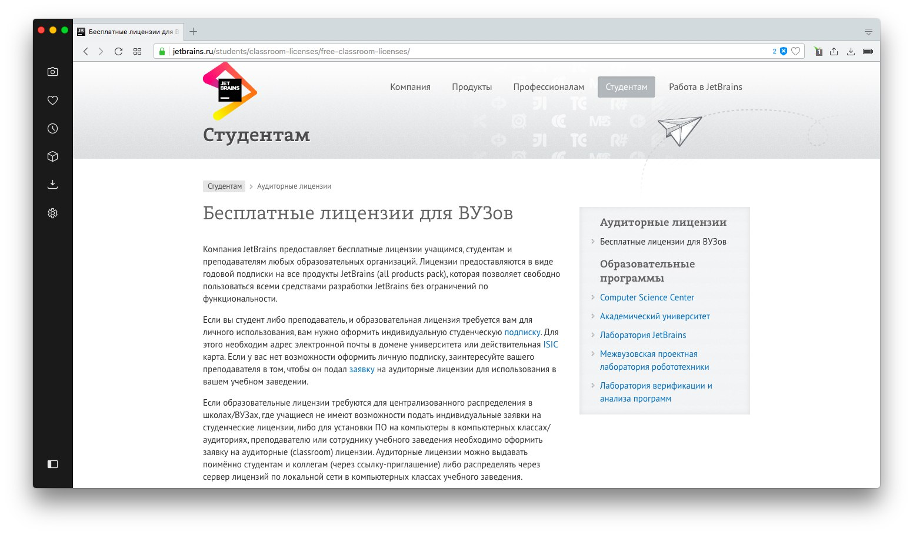
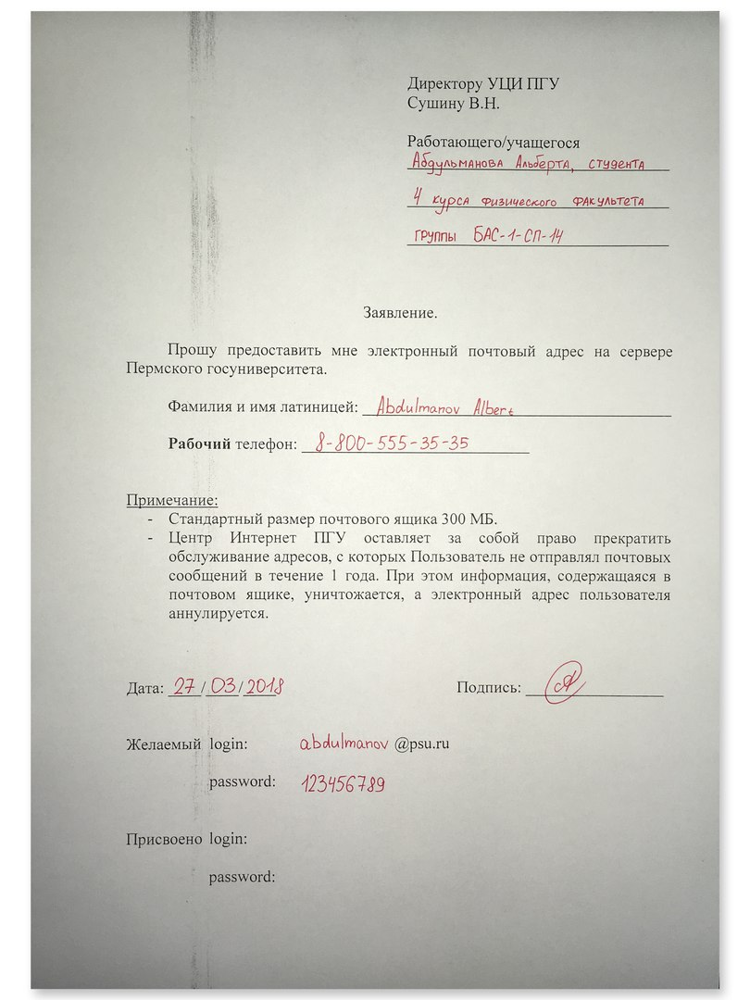

## Зачем нужна почта с доменом вуза?

В прошлом году я купил себе макбук со скидкой 11%. В качестве подарка Apple добавили к заказу наушники *Beats Solo 3*. 
Акция проходила для школьников, студентов и аспирантов.

На днях корпорация из Купертино анонсировала новый *iPad* с улучшенным процессором, поддержкой дополненной реальности и специальной ручкой. Цена устройства — **329$**. Для учащихся на **30 долларов** дешевле.

|  | 
|:--:| 
| *Анонс нового iPad 9.7'' на сайте Apple* |

Последний бонус, который можно получить от *Apple*, если ты являешься студентом — студенческая подписка на **Apple Music**. Индивидуальная стоит **169 рублей** в месяц. Я же плачу **75 ₽**. Кайф.

Программируя на питоне, я пользуюсь интегрированной средой разработки от *JetBrains* — **PyCharm**. Очень хорошая программа, но платная. Первый год использования обойдется в **199$**, потом чуть дешевле. Меня спасло то, что для вузов лицензия на все продукты абсолютно бесплатная.

|  |
|:--:|
| *JetBrains предоставляет бесплатные лицензии для учащихся и преподавателей вузов* | 

И это не все компании, которые предоставляют бонусы для студентов. Вот, что я нашел за 10 минут поиска в гугле:

* РЖД
* Samsung
* Nike
* Reebok
* New Balance

Есть несколько способов подтвердить факт обучения в вузе. Можно отсканировать студенческий билет, а можно использовать почту своего вуза. ПГНИУ позволяет своим студентам и сотрудникам зарегистрировать почтовый ящик на своем сервере. Я сделал так.

## Как получить почту с доменом psu.ru?
На сайте [Университетского Центра Интернет](https://k.psu.ru/centre/mail) есть инструкция, но туда мало кто заходит и мало кто знает об этой возможности. Рассказываю про свой опыт получения почтового ящика с доменом любимого вуза.

Порядок действий:

1. **Скачать заявление**
1. **Распечатать заявление**
1. **Заполнить необходимые поля**
Их там немного: основные данные о себе, имя-фамилия латиницей, телефон, желаемые логин и пароль, дата. 
Я был уверен, что ящик с моей фамилией не занят, но людям с более популярными фамилиями стоит придумать себе что-то другое. Например, Ивану Петрову подойдет *i.petrov@psu.ru*. Что-то подобное лучше не писать: *megaivan@psu.ru*. Я думаю, если техподдержка увидит совпадение имен или некорректное название, то просто выдаст на свое усмотрение и уведомит по телефону.
1. **Отнести заявление в Интернет-центр**
1. **Ждать**

Обычно почта активируется быстро — в течение часа. Проверить, произошло ли это, можно по адресу http://mail.psu.ru. Обратите внимание, что используется протокол HTTP. Это значит, что трафик **не шифруется!**

Злоумышленник, находящийся в той же сети, может перехватить как пароль, так и входящую/исходящую почту. Мы делали это на парах по Сетям и системам передачи информации и даже увели несколько паролей. Потом, конечно же, сразу их удалили и трижды отформатировали все носители.
Лучше не использовать университетскую почту для важной корреспонденции.

|  |
|:--:|
| *Заполненное заявление на получение почтового ящика на сервере ПГНИУ* | 

Заполненное заявление нужно отнести в Интернет-центр. Он находится во втором корпусе, слева от входа. Там же, где принимают оплату за интернет, распечатывают лабы и курсовые.

Для потеряшек нарисовал, как пройти.

|  |
|:--:|
| *Расположение Университетского Центра Интернет* | 

## Примечания

* Размер ящика ограничен 300 мегабайтами
* Если год не отправлять письма, ящик блокируется. Поэтому лучше отправлять куда-нибудь письма-болванки раз в год.

Вот, как выглядит почта снаружи и внутри.

|  |
|:--:|
| *Почта снаружи* | 

|  |
|:--:|
| *Почта внутри* | 

Мое мнение: пользоваться максимально неудобно.

## Заключение
Надеюсь, это маленькое руководство будет кому-то полезно.
Становитесь частью университета, получайте скидки, читайте [СпектрЪ](https://vk.com/fizgazeta), смотрите [Резонанс](https://vk.com/fizgazeta). Алоха.